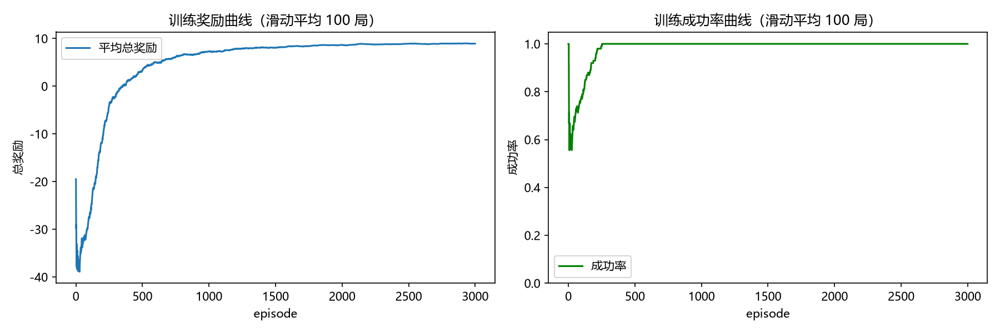
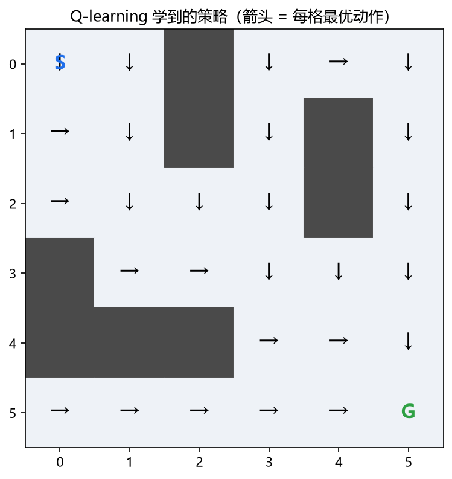
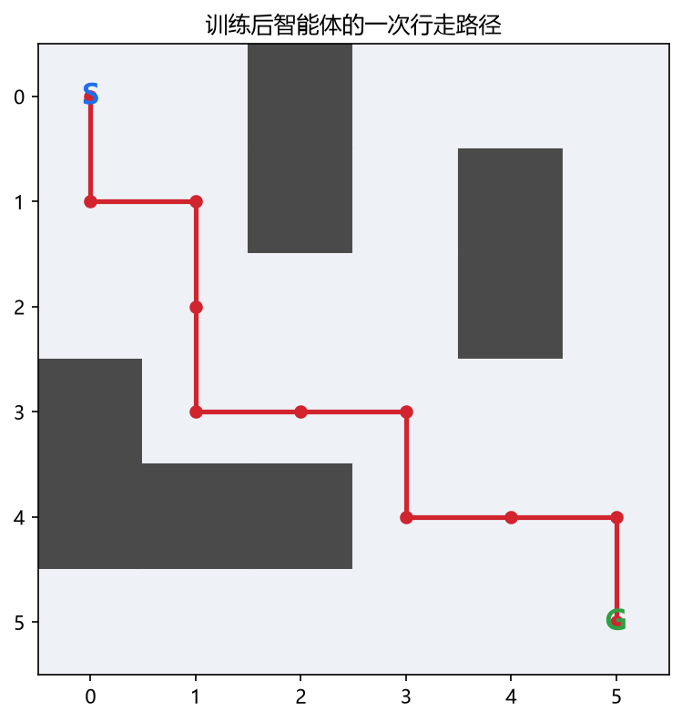

# 基于 Q-Learning 的智能体迷宫自主导航系统

一个用经典 Q-learning（Q 表）实现的 6×6 迷宫导航项目。
智能体从起点出发，通过反复试错学会避开墙壁、走向终点，
最终收敛到一条 10 步的最优路径。

技术栈：Python + numpy + matplotlib，无深度学习框架。
代码结构清晰、注释详细，适合大一学生作为强化学习入门项目。

## 项目结构

```text
maze-qlearning/
├── env.py          # 迷宫环境：地图、状态、动作、奖励
├── agent.py        # Q-learning 智能体：Q 表、epsilon-greedy、更新公式
├── train.py        # 训练主程序：3000 局训练 + 保存 Q 表 + 训练曲线
├── evaluate.py     # 评估：贪心策略 100 局，与随机策略对比
├── visualize.py    # 可视化：策略箭头图 + 行走路径图
├── experiments.py  # 实验：alpha / 训练轮数 / epsilon 三组对比
├── tests.py        # 自动化测试：环境规则、更新公式、可复现性
├── requirements.txt
├── index.html      # 项目介绍页（首页，科技风格）
├── tutorial.html   # 12 步学习教程页
├── tutorial.css    # 教程页样式
├── tutorial.js     # 教程页导航与进度
├── demo.html       # 交互式 Q-learning 学习台
├── intro.css       # 介绍页样式
├── intro.js        # 介绍页背景与动效
├── style.css       # 学习台样式
├── app.js          # 学习台逻辑：环境、Q-learning、绘制
├── README.md
└── results/        # 训练曲线、Q 表、策略图、路径图、实验图
```

## 快速开始

1. 创建虚拟环境并安装依赖：

```bash
python -m venv venv
venv\Scripts\activate        # Windows
source venv/bin/activate     # macOS / Linux
pip install -r requirements.txt
```

2. 运行测试：

```bash
python tests.py
```

3. 训练、评估、可视化、实验：

```bash
python train.py
python evaluate.py
python visualize.py
python experiments.py
```

## 网页可视化

项目自带三个网页，无需安装依赖或启动服务器：

- 首页介绍：`index.html`，项目介绍与成果展示；
- 学习教程：`tutorial.html`，12 步从零写代码，支持进度记录；
- 交互学习台：`demo.html`，实时观察智能体学习；
- 功能：播放/暂停/单步/重置训练，实时调节学习率 α、折扣因子 γ、初始探索率与每局衰减；
- 展示：迷宫、智能体路径、策略箭头、Q 值热度、训练曲线，以及最近一次 Q 更新的数值。

网页里的算法逻辑和 Python 版保持一致，适合边看边理解 Q 更新公式。
启用 GitHub Pages 后，公开链接为：`https://WuHaolin318.github.io/maze-qlearning/`

## 核心概念讲解

### 1. 强化学习四要素

- state（状态）：智能体当前所在位置，代码中用 `(row, col)` 表示。
- action（动作）：上、下、左、右，代码中用数字 `0/1/2/3` 表示。
- reward（奖励）：环境对动作的即时反馈，正奖励鼓励、负奖励惩罚。
- episode（一局）：从 `env.reset()` 开始，到到达终点或步数超限结束。

### 2. Q 表是什么

Q 表是一张二维表格：

```text
           上    下    左    右
(0,0)    Q=0.1 Q=0.5 Q=0.2 Q=0.3
(0,1)    Q=... ...
```

`Q(s,a)` 表示“在状态 s 执行动作 a，之后一直按最优策略走，
预计能得到的总回报”。数值越大，说明这个动作在这个位置越值得做。
训练的本质，就是不断修正这张表里的数字。

### 3. epsilon-greedy 探索策略

- 以 `epsilon` 的概率随机选动作（exploration，探索）；
- 以 `1 - epsilon` 的概率选 Q 值最大的动作（exploitation，利用）。

训练初期 `epsilon=1.0`，智能体几乎完全乱走，这样才能发现终点；
每局结束 `epsilon` 乘以 `0.999`，逐步降到 `0.05`，后期更多利用学到的经验。

### 4. Q 更新公式

```text
Q(s,a) <- Q(s,a) + alpha * ( r + gamma * max Q(s',a') - Q(s,a) )
```

把公式拆成三块理解：

- `r`：这次动作实际拿到的奖励；
- `gamma * max Q(s',a')`：对“下一个状态能拿到的未来回报”的估计，并按 gamma 打折；
- `r + gamma * max Q(s',a')`：目标值（TD target），比旧估计更接近真实回报；
- `alpha`：每次朝目标值走多大一步。

手算例子（来自 `tests.py`）：

```text
初始 Q(状态0, 动作0) = 0
执行动作后拿到奖励 r = 1，下一个状态不是终点
alpha = 0.5, gamma = 0.9

TD target = 1 + 0.9 * 0 = 1
新 Q = 0 + 0.5 * (1 - 0) = 0.5
```

### 5. 超参数含义

| 参数 | 默认值 | 含义 | 调大 / 调小的影响 |
| --- | --- | --- | --- |
| alpha | 0.1 | 学习率，新信息占比 | 太大震荡、太小学得慢 |
| gamma | 0.9 | 折扣因子，未来奖励权重 | 太大短视、太小只看眼前 |
| epsilon | 1.0 → 0.05 | 探索概率 | 太多乱走、太少学不到新经验 |
| N_EPISODES | 3000 | 训练局数 | 太少学不完、太多浪费时间 |
| MAX_STEPS | 150 | 每局最大步数 | 防止无限循环 |

## 环境与奖励设计

地图编码：`0` 空地、`1` 墙、`2` 起点、`3` 终点。

| 事件 | 奖励 | 设计理由 |
| --- | --- | --- |
| 到达终点 | +10 | 明确告诉智能体什么是对的 |
| 撞墙 / 越界 | -1 | 惩罚无效动作，且位置不变 |
| 普通移动 | -0.1 | 小惩罚：让智能体倾向于走更短的路 |

## 结果

### 训练曲线



3000 局训练后，最后 100 局平均奖励 8.92，成功率 100%。

### 评估对比

```text
Q-learning（贪心策略）: 成功率 100.0% | 平均步数 10.0
随机策略对照          : 成功率  50.0% | 平均步数 120.8
```

### 策略与路径





智能体学到的最优路径（10 步）：

```text
(0,0) -> (1,0) -> (1,1) -> (2,1) -> (3,1) -> (3,2)
      -> (3,3) -> (4,3) -> (4,4) -> (4,5) -> (5,5)
```

## 实验分析

### 实验 1：学习率 alpha

```text
alpha = 0.05 | 首次连续100局成功率>=90%: episode 168 | 最终成功率 100% | 平均步数 10
alpha = 0.1  | 首次连续100局成功率>=90%: episode 170 | 最终成功率 100% | 平均步数 10
alpha = 0.3  | 首次连续100局成功率>=90%: episode 164 | 最终成功率 100% | 平均步数 10
```

结论：在 6×6 小地图上，不同 alpha 最终都能收敛到最优路径，
学习速度差异很小。这说明简单确定性环境对 alpha 不敏感；
更复杂的环境（随机移动、更大的地图）中差异会更明显。

### 实验 2：训练轮数

```text
训练  500 局 | 成功率 100% | 平均步数 10
训练 1500 局 | 成功率 100% | 平均步数 10
训练 3000 局 | 成功率 100% | 平均步数 10
```

结论：小地图学习成本低，500 局已经足够收敛；
这个实验更重要的是说明“评估要看最终成功率，学习过程要看曲线”。

### 实验 3：探索策略

```text
固定 epsilon=0.05 | 首次连续100局成功率>=90%: episode 100 | 最终成功率 100%
固定 epsilon=0.30 | 首次连续100局成功率>=90%: episode 100 | 最终成功率 100%
衰减 1.0→0.05     | 首次连续100局成功率>=90%: episode 170 | 最终成功率 100%
```

结论：前期固定较小的 epsilon 因为“乱走”少，更早达到高成功率；
衰减版从 100% 随机开始，起步较慢，但后期 epsilon 变小后策略稳定。
在更复杂的迷宫里，探索太少会卡在局部，衰减策略通常更稳。

## 常见问题与下一步

**为什么用 Q 表而不是神经网络？**
本项目的状态是 36 个格子，Q 表只有 36×4 个数字，足够且可解释。
当地图很大或状态连续（如无人机位置、图像输入）时，Q 表会爆炸，
这时才需要 DQN 等深度强化学习方法。

**可能的扩展方向**

- DQN：用神经网络逼近 Q 值，处理大状态空间；
- 随机环境 / 连续控制：对应团队方向中的无人机软硬件、世界模型；
- 用演化计算搜索超参数：把 alpha、gamma、epsilon 衰减当优化问题，
  对应团队方向中的演化计算、自动算法设计；
- 多智能体与 LLM 后训练中的 reward 设计思想也有相通之处。
